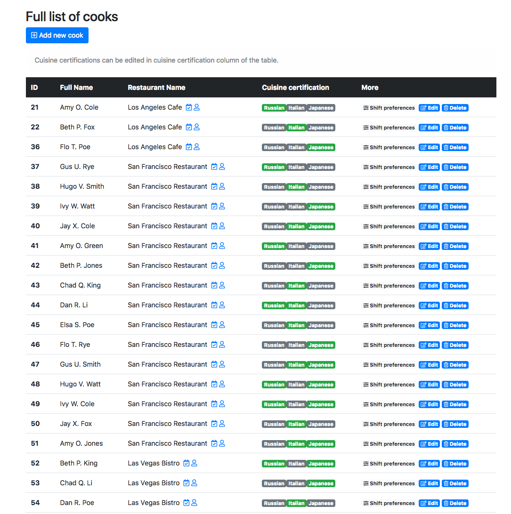
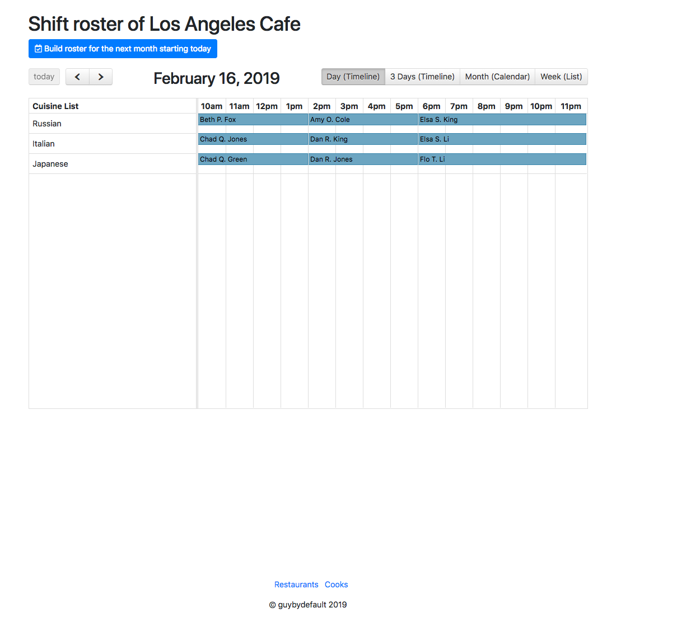

# Restaurant Network

Application is built as a practice task for Arcadia. It is written in Java and based on Spring Boot + Data + Web + Hibernate and Thymeleaf for view rendering. PostgreSQL is used as a DBMS.

## Getting Started

Data generation script is located in resources folder and is named 'import.sql'. Due to the option
```
spring.jpa.hibernate.ddl-auto = create-drop
```
data is loaded in database each time application starts and is dropped from database after.

## Screenshots
View of cook list

View of shift roster



